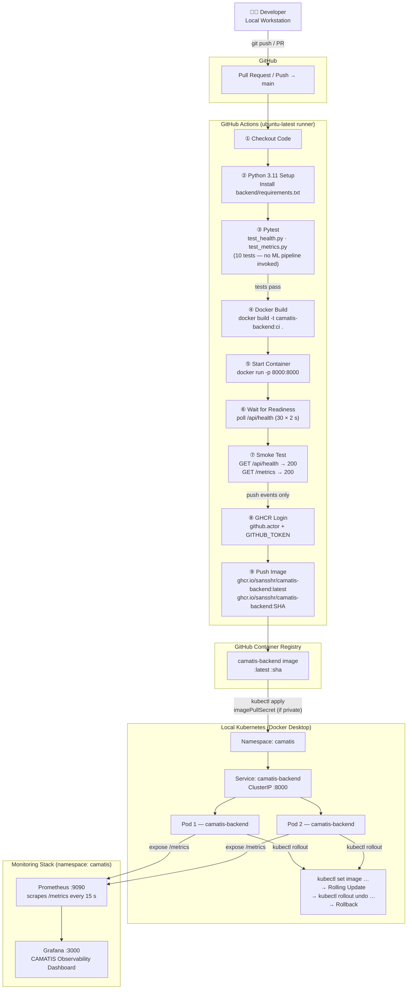

# CAMATIS DevOps CA2 — Pipeline Diagram

## CI/CD and Deployment Flow



---

## Key Checkpoints

| Step | Tool | Artefact |
|------|------|----------|
| Code quality gate | pytest | 10 tests, 0 failures |
| Container validation | docker run + curl | /api/health 200, /metrics 200 |
| Image registry | GHCR | ghcr.io/sansshr/camatis-backend |
| Environment provisioning | Ansible | Ubuntu WSL runtime configured |
| Workload orchestration | Kubernetes | 2-replica Deployment, RollingUpdate |
| Observability | Prometheus + Grafana | 4-panel dashboard |

---

## Lazy Loading Behaviour

```
FastAPI starts (< 2 s)
    └─ /api/health  → 200 OK   ← immediately available
    └─ /metrics     → 200 OK   ← immediately available
    └─ CAMATIS ML pipeline     ← NOT initialised yet

First POST /api/optimize
    └─ camatis.run_agents_pipeline imported  (torch, lightgbm, catboost …)
    └─ CAMATISDecisionPipeline() constructed  (10–60 s)
    └─ pipeline.run() executed
    └─ subsequent calls reuse singleton
```
